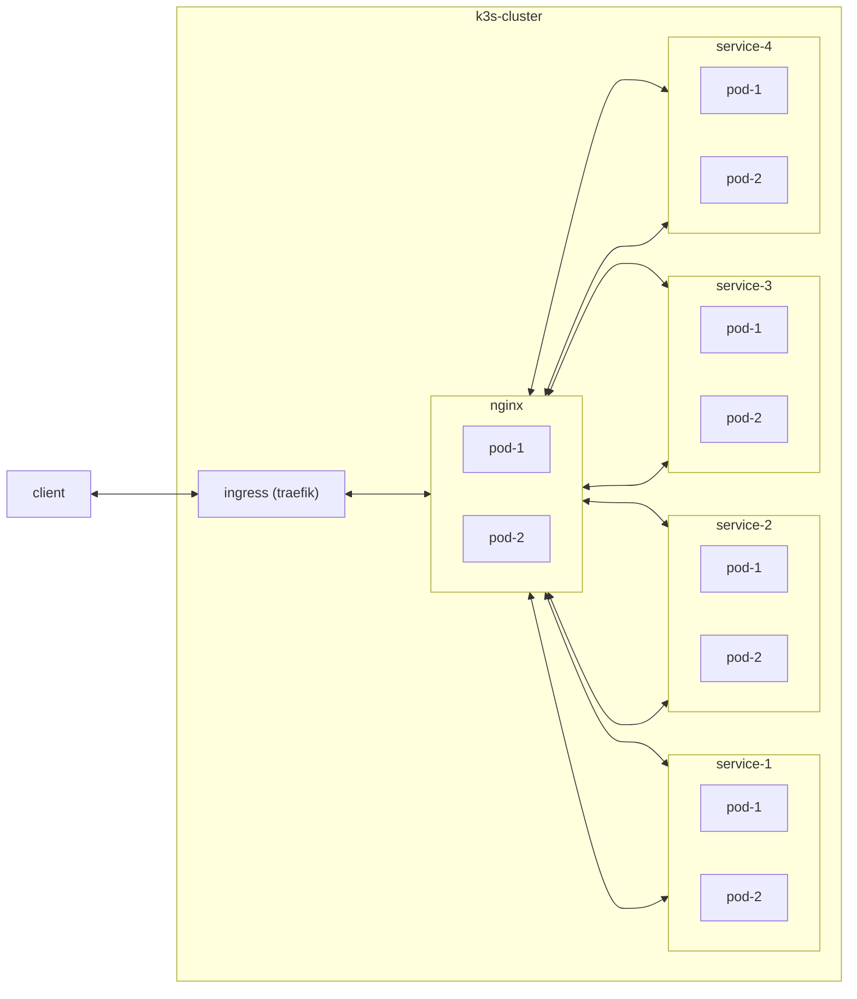

## Simple Service



```bash
 # step 0: add helm repo
 helm repo add bitnami https://charts.bitnami.com/bitnami
 helm repo add traefik https://traefik.github.io/charts

 # step 1: install ingress
 helm upgrade traefik --install  traefik/traefik

 # step 2: deploy
 testup:
	kubectl apply -f ./kube
```
