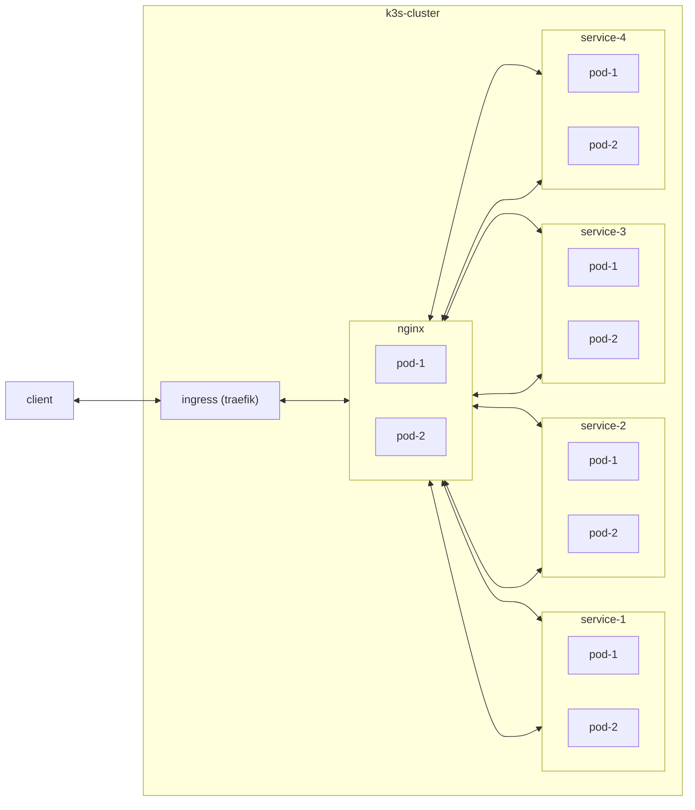

## Simple Service



```bash
 # step 0: add helm repo
 helm repo add bitnami https://charts.bitnami.com/bitnami
 helm repo add traefik https://traefik.github.io/charts

 # step 1: install ingress
 helm upgrade traefik --install  traefik/traefik

 # step 2: deploy
 testup:
	kubectl apply -f ./kube
```

### How to setup cluster

```bash
# Master node
curl -sfL https://get.k3s.io | K3S_TOKEN=K100c989fc8c805b6526381df2a8ba92a3c87ca540cc652cae926ce3fd40a8cf79c::server:815a7bdbdfc1ea1a434eb88688a8b565 sh -s - server --cluster-init

export KUBECONFIG=/etc/rancher/k3s/k3s.yaml

helm --kubeconfig /etc/rancher/k3s/k3s.yaml repo add bitnami https://charts.bitnami.com/bitnami
helm --kubeconfig /etc/rancher/k3s/k3s.yaml repo add traefik https://traefik.github.io/charts
sudo helm --kubeconfig /etc/rancher/k3s/k3s.yaml upgrade traefik --install  traefik/traefik --namespace kube-system

sudo more /var/lib/rancher/k3s/server/node-token

curl -sfL https://get.k3s.io | K3S_TOKEN=K10ed408c27031cb5665bdda121f1d68b3f4cc8fb93c96ac155604460b101b23ee2::server:815a7bdbdfc1ea1a434eb88688a8b565 sh -s - server \
    --server https://192.168.0.51:6443

curl -sfL https://get.k3s.io | K3S_TOKEN=K10ed408c27031cb5665bdda121f1d68b3f4cc8fb93c96ac155604460b101b23ee2::server:815a7bdbdfc1ea1a434eb88688a8b565 sh -s - agent --server https://192.168.0.51:6443

sudo kubectl label node node-worker-1 node-role.kubernetes.io/worker=worker
sudo kubectl label node raspberrypi1 node-role.kubernetes.io/worker=worker
sudo kubectl label node raspberrypi2 node-role.kubernetes.io/worker=worker
sudo kubectl label node raspberrypi4 node-role.kubernetes.io/worker=worker


# Worker node (raspberrypi)
append cgroup_memory=1 cgroup_enable=memory to /boot/cmdline.txt
sudo apt-get install network-manager
sudo reboot 0
run k3s install command with token

```
